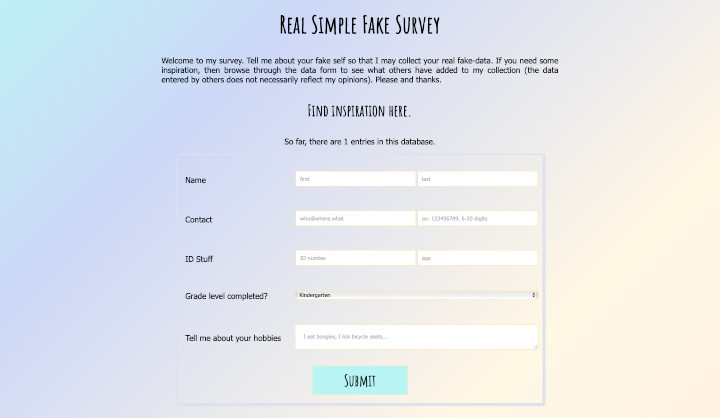

# [Simple Survey v2]()
A simple, goofy survey for data collection.

## Purpose/Goal
To upgrade my original FCC project using MongoDB, and pug templates.  
To show how I've improved over the last couple of years by redoing an old project.

## Operation
* Fill out the form and click submit.
* New data is entered into the database and you will see results on the next screen.
* Send the form to a friend with the Twitter link.

## Tech/Libraries Used
* HTML
* CSS
* JavaScript
* Pug
* MongoDB

## Problems/Solutions
N/A

## More Information
The original (version 1) simple survey can be found [here](https://s3-ap-northeast-1.amazonaws.com/wmcooper2.com/fcc-projects/survey/survey.html) if you are interested to see how I've progressed.  
[Color Palette](https://paletton.com/#uid=73i0u0k5vLq0tZR2rUl9z-reHsl)

